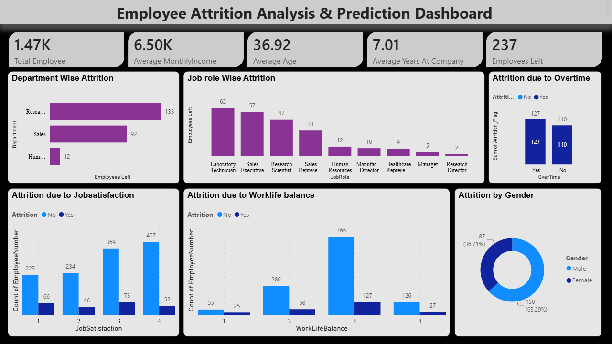
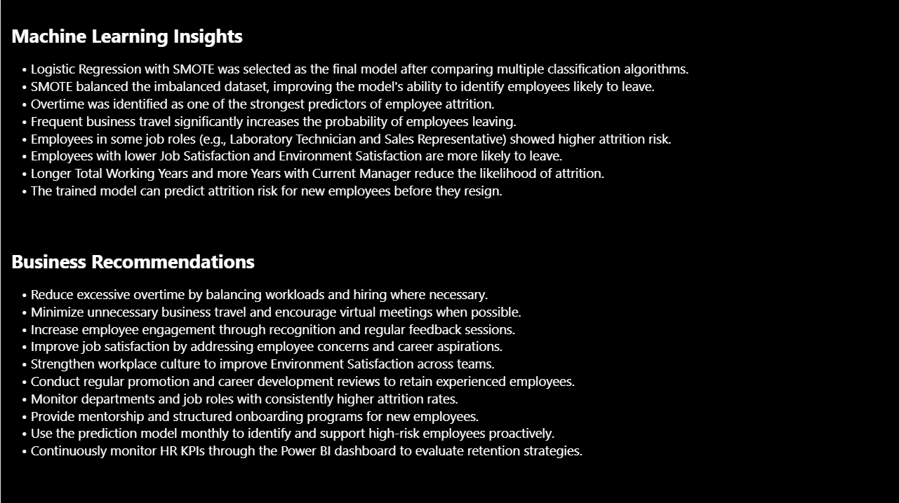

# Employee Attrition Prediction using Machine Learning


---

# Project Overview

Employee attrition is one of the major challenges faced by organizations. Losing experienced employees increases recruitment costs, training expenses, and affects overall productivity.

This project uses Machine Learning techniques to analyze employee data and predict whether an employee is likely to leave the organization. Along with predictive modeling, an interactive Power BI dashboard is created to provide meaningful business insights into employee attrition.

---

# Problem Statement

Develop a Machine Learning model that can accurately predict employee attrition based on various employee-related features and identify the major factors contributing to employee turnover.

---

# Dataset

**Dataset:** IBM HR Analytics Employee Attrition Dataset

The dataset contains information such as:

- Employee Age
- Department
- Job Role
- Education
- Monthly Income
- Business Travel
- Distance From Home
- Overtime
- Job Satisfaction
- Work-Life Balance
- Years at Company
- Performance Rating
- Attrition (Target Variable)

---

# Project Objectives

- Perform Exploratory Data Analysis (EDA)
- Clean and preprocess the dataset
- Handle categorical variables
- Scale numerical features
- Train multiple Machine Learning models
- Evaluate model performance
- Identify important features affecting attrition
- Build an interactive Power BI dashboard

---

# Technologies Used

| Technology | Purpose |
|------------|----------|
| Python | Programming |
| Pandas | Data Manipulation |
| NumPy | Numerical Operations |
| Matplotlib | Data Visualization |
| Seaborn | Statistical Visualization |
| Scikit-Learn | Machine Learning |
| Joblib | Model Saving |
| Jupyter Notebook | Development |
| Power BI | Dashboard & Visualization |

---

# Project Workflow

```
Raw Dataset
      │
      ▼
Exploratory Data Analysis
      │
      ▼
Data Cleaning
      │
      ▼
Feature Engineering
      │
      ▼
Encoding Categorical Features
      │
      ▼
Feature Scaling
      │
      ▼
Train-Test Split
      │
      ▼
Model Training
      │
      ▼
Hyperparameter Tuning
      │
      ▼
Model Evaluation
      │
      ▼
Power BI Dashboard
```

---

# Exploratory Data Analysis

The following analyses were performed:

- Missing Value Analysis
- Data Type Inspection
- Distribution Analysis
- Correlation Analysis
- Attrition Distribution
- Numerical Feature Analysis
- Categorical Feature Analysis
- Outlier Detection

---

# Data Preprocessing

The preprocessing pipeline includes:

- Handling missing values
- Removing unnecessary columns
- One-Hot Encoding
- Feature Scaling
- Train-Test Split

---

# Machine Learning Models

The following algorithms were implemented and compared:

- Logistic Regression
- Decision Tree
- Random Forest
- Support Vector Machine
- K-Nearest Neighbors

---

# Model Evaluation Metrics

The models were evaluated using:

- Accuracy
- Precision
- Recall
- F1-Score
- Confusion Matrix
- ROC Curve
- Classification Report

---

# Power BI Dashboard

An interactive Power BI dashboard was developed to visualize:

- Employee Attrition Overview
- Department-wise Attrition
- Attrition by Job Role
- Monthly Income Analysis
- Age Distribution
- Overtime Analysis
- Gender Distribution
- Work-Life Balance
- Job Satisfaction
- Years at Company

## Dashboard Preview


## Insights


```
Dashboard/
Employee Attrition Dashboard.pbix
```

---

# Project Structure

```
Employee-Attrition-Prediction/

│
├── Dashboard/
│   └── Employee Attrition Dashboard.pbix
│
├── Data/
│   ├── raw/
│   └── processed/
│
├── Images/
│
├── Jupyter_Notebooks/
│   ├── 01_EDA.ipynb
│   ├── 02_Data_Preprocessing.ipynb
│   └── 03_Model_Training_and_Improvement.ipynb
│
├── Models/
│
├── PPT/
│
├── README.md
├── requirements.txt
├── LICENSE
└── .gitignore
```

---

# Results

The project successfully:

- Identified the major factors influencing employee attrition.
- Compared multiple Machine Learning algorithms.
- Evaluated model performance using standard classification metrics.
- Built an interactive Power BI dashboard for business decision-making.

---

# Future Improvements

- Hyperparameter Optimization
- Feature Selection
- Model Deployment using Flask/FastAPI
- Streamlit Web Application
- Docker Containerization
- Cloud Deployment (AWS/Azure)

---

# How to Run the Project

## Clone Repository

```bash
git clone https://github.com/Loukik9999/Employee-Attrition-Prediction.git
```

## Navigate

```bash
cd Employee-Attrition-Prediction
```

## Install Dependencies

```bash
pip install -r requirements.txt
```

## Launch Jupyter Notebook

```bash
jupyter notebook
```

Run the notebooks in the following order:

1. 01_EDA.ipynb
2. 02_Data_Preprocessing.ipynb
3. 03_Model_Training_and_Improvement.ipynb

---

# Repository Contents

- Source Code
- Dataset
- Jupyter Notebooks
- Power BI Dashboard
- Project Presentation
- Documentation

---

# Author

**Loukik Ingale**

Data Science & Machine Learning Enthusiast

